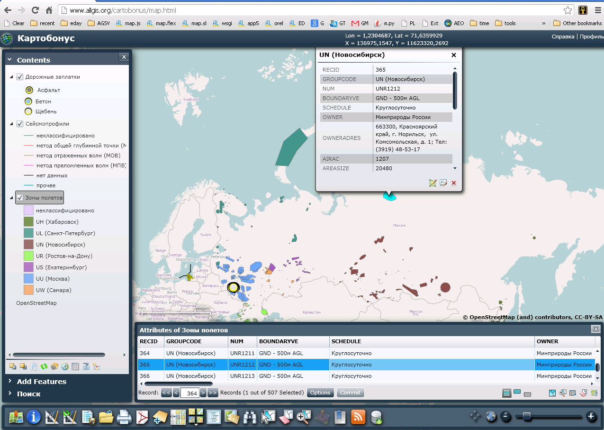

# Cartobonus
Custom web maps viewer, ArcGIS Silverlight API

Heavily customized ArcGIS Viewer for Silverlight.
Loads of C# code and a few extra services.
Forgotten and forsaken.

About
* Video presentation: https://youtu.be/WO0re-iIWlw
* A few words in my blog: http://vasnake.blogspot.com/2013/02/arcgis-web-maps.html

### Folders
 - agsproxy: MS IIS app, proxy for external ArcGIS Server REST services;
 - app4: map viewer customized for specific application;
 - app5: map viewer customized for another specific application;
 - data: ETL tool used for preparing datasources;
 - Ice: viewer extension for specific app;
 - kvsproxy: MS IIS app, proxy for KV storage service;
 - maps.web.builder: Cartobonus itself;
 - Products.VKeyValObj: Python package for Zope, one of implementations of KV storage;
 - QueryRelatedRecords: viewer extension for querying map linked data.
